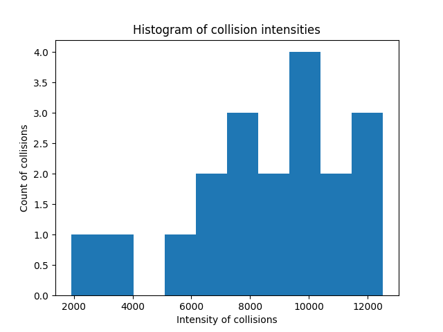

# Openpilot + CARLA Testing Framework
This folder contains a sample framework to allow for the repetitive testing of
openpilot under CARLA simulation.

The test framework provides scaffolding in `test_runner.py` to automatically run
tests repeatedly while ensuring that CARLA and openpilot are in their correct
state to run.

For each test, the framework spawns a new instance of openpilot and gives it
a specific directory on disk to save results. To save data, the `bridge.py`
script can save to the `/test_directory/*` folder. This will appear outside
of the container at `<path_to_test_suite>/test_<NUM>/*`. 

The `bridge.py` script must be configured to perform any treatment required for 
the test, e.g. spawning in other vehicles to test.


## Provided Sample
In this sample, we set openpilot the task of driving for 60 seconds while
monitoring for collisions. There is currently a bug in my setup, so most of the 
time openpilot collides with an obstacle before reaching the timeout.

### Setting up `bridge.py`
In `bridge.py` there are two main considerations we need. First, since we are
checking for collisions, we need to add a callback to handler the collision.


```python
global events
events = []
global intensities
intensities = []
def collision_handler(event):
  global events
  impulse = event.normal_impulse
  intensity = math.sqrt(impulse.x**2 + impulse.y**2 + impulse.z**2)
  events.append(event)
  intensities.append(intensity)
```

Then, we need to register this collision handler with CARLA. In the main 
`def bridge(q):` function, we add:

```python
  vehicle.apply_physics_control(physics_control)
  # NEW CODE
  collision_sensor = world.spawn_actor(blueprint_library.find('sensor.other.collision'),
                                        carla.Transform(), attach_to=vehicle)

  collision_sensor.listen(lambda event: collision_handler(event))
```

Then, we need to know if the collision has occurred and we need to stop. To do
this, we go to the end of the function, where the main print out happens

```python
    if rk.frame % PRINT_DECIMATION == 0:
      ## ADDED TO MAKE ALWAYS GO MAX SPEED (constantly cruise up)
      q.put("cruise_up")
      ## END ADD
      print("frame: ", "engaged:", is_openpilot_engaged, "; throttle: ", round(vc.throttle, 3), "; steer(c/deg): ", round(vc.steer, 3), round(steer_out, 3), "; brake: ", round(vc.brake, 3))
      if len(events) > 1:
        max_intensity = max(intensities)
        if max_intensity > 2 * intensities[-1]:
          index = intensities.index(max_intensity)
          event = events[index]
          impulse = event.normal_impulse
          with open('/test_directory/collision_data.txt', 'w') as f:
            f.write('Collision between\n')
            f.write('%s\n' % event.actor)
            f.write('%s\n' % event.other_actor)
            f.write('Impulse (x, y, z)\n')
            f.write('%f %f %f\n' % (impulse.x, impulse.y, impulse.z))
            f.write('Intensity\n')
            f.write('%f\n' % max_intensity)
          os.system('tmux kill-server')
```

This block does two things. First, it adds a message to the queue telling 
the system to cruise at a faster speed. This is what starts the test. Note that
we do not know how fast the car is going, so this will increase the speed 1 mph
per tick until the end of the test. Second, there is logic to check the previous
collision events and determine if they warrant stopping the system. We check
```python
if max_intensity > 2 * intensities[-1]:
```
This is because as the car collides with something it can trigger many separate
collision events of different magnitude. We want to try to capture only the
largest impact.

For other users, the most crucial bits here are the ability to print out to a
known location:
```python
with open('/test_directory/collision_data.txt', 'w') as f:
```
and the ability to gracefully kill the entire openpilot docker container
 internally:
```python
os.system('tmux kill-server')
```

### Example Data
I used the above script to run 20 tests which can be seen in 
`test_results/2022-03-01T23_29_20.907060`. Each of these folders contains a test
script, a collision information script, and a timing information script.
I then use `collision_intensity_parser.py` to read these files. From that, I
generated this histogram of the collision information:


